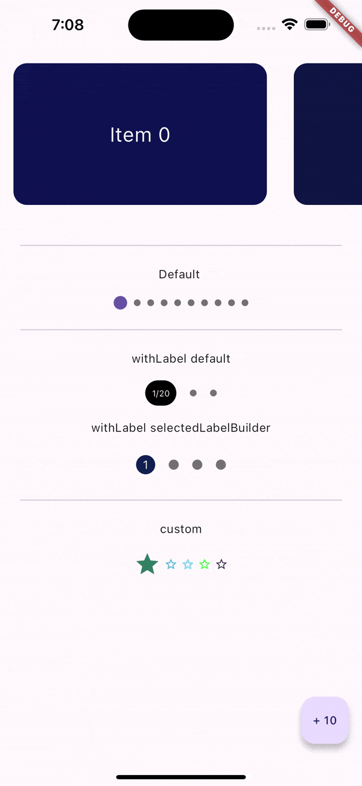

## Introduction

This package provides a Dots Indicator of which the developer can customise anything that's needed to. Here's what you can customise:

1. Number of Dots
2. Provide a Label and customise it
3. Customise each Dot/Label for the current scroll index and by the Dot index

Note: Currently, only supports the use of a `ScrollController` for your scrollable views. You can also use `PageController` here because it is an instance of `ScrollController`.

To learn more about the why's and the how's of this package, see this [article](https://uncoded-decimal.medium.com/custom-scroll-dots-indicator-f3a8a0e0b1fb).



## Usage

You can start using this package by simply calling:

```dart
    /// For the Generic use-case of all dots
    CustomDotsIndicator()

    /// If your app needs a Label
    CustomDotsIndicator.withLabel()

    /// If the need to completely customise
    /// the label and other dots arises
    CustomDotsIndicator.custom()
```

#### Parameters

##### Required

1. **listLength**

   This is the length of the list for which the indicator is to be used.

   _This helps calculate the range for which the active dot position would be calculated._

2. **controller**

   The `ScrollController` instance to be provided to your scrollable widget.

   _This helps the widget receive updates on `ScrollController` updates an helps with further calculations._

##### Optional (_Present for all cases_)

1. **dotsCount**

   This is the number of dots you want for your indicator.

   _Defaults to 3._

2. **dotsDistance**

   This is the space to be used between the dots.

   _Defaults to 8 px._

3. **activeDotRadius**

   The radius to be used for each of the _active_ dots.

   _Defaults to 4 px._

4. **inactiveDotRadius**

   The radius to be used for each of the _inactive_ dots.

   _Defaults to 4 px._

5. **activeDotColor**

   The color to be used for the _active_ dot.

6. **inactiveDotRadius**

   The color to be used for each of the _inactive_ dots.

7. **customDotSpaceBuilder**

   Helps customise the space between the dots.

8. **customDotsTransition**

   Animation to use for building the active/inactive dots.

### Customisation

`CustomDotsIndicator.withLabel` offers two optional parameters:

1. `labelStyle`

   This helps customise the default text on the default Label.

2. `selectedLabelBuilder`

   This helps customise and build your own Label widget from two variables:

   1. **`currentIndex`**: the calculated visible item on the screen,
   2. **`dotIndex`**: the position of the current dot.

   

`CustomDotsIndicator.custom` offers one more optional parameter _with_ the above listed two:

1. `unselectedDotBuilder`

   This helps bring the inactive dots under customisation. Much like the `selectedLabelBuilder`, it takes the same two variables but uses them to render the _inactive_ dots.
